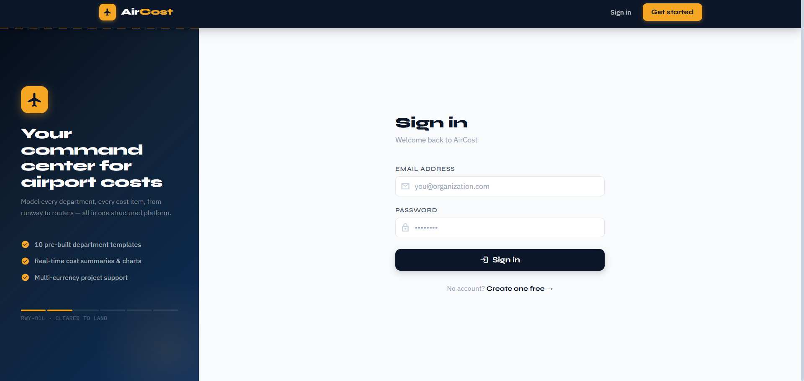
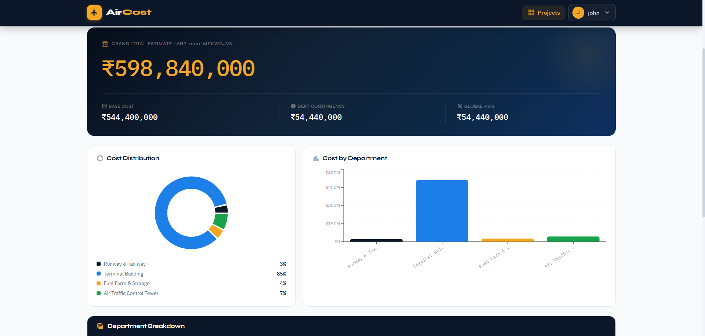
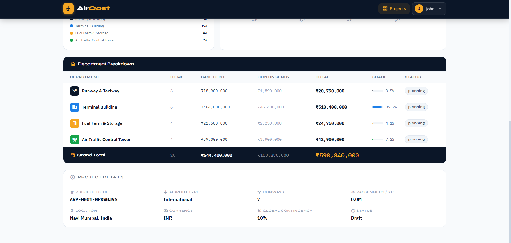

# ✈️ Airport Cost Estimator

A full-stack web application for estimating and managing airport project costs by department.

Built with **React**, **Node.js**, **Express**, and **MongoDB**.

---

## 📸 Features

- 🔐 User authentication — Register, Login, JWT protected routes
- 📊 Dashboard with project overview and cost charts
- 🏗️ Create and manage airport projects
- 🏢 Add departments with detailed cost breakdowns
- 📈 Visual cost summaries using Recharts
- 👤 User profile management
- 📱 Fully responsive design

---

## screenshots

Dashboard Page : 

Signup Page : 

Cost Page : 

Summary Page : 

## 🛠️ Tech Stack

| Layer | Technology |
|---|---|
| Frontend | React 18, React Router v6, Axios, Recharts, Lucide Icons |
| Backend | Node.js, Express.js, express-validator |
| Database | MongoDB, Mongoose |
| Auth | JWT, bcryptjs |
| Styling | Custom CSS |

---

## 📁 Project Structure

```
airport-cost-estimator/
├── client/                        # React frontend
│   ├── public/
│   └── src/
│       ├── components/
│       │   ├── auth/              # ProtectedRoute
│       │   ├── layout/            # Navbar
│       │   └── project/           # DepartmentCard, CostSummary, AddDepartmentModal
│       ├── context/               # AuthContext, ToastContext
│       ├── pages/                 # LandingPage, LoginPage, RegisterPage
│       │                          # DashboardPage, ProjectPage, ProfilePage
│       ├── styles/                # global.css
│       └── utils/                 # Axios API config
│
└── server/                        # Node/Express backend
    ├── middleware/                 # JWT auth middleware
    ├── models/                    # User, Project (Mongoose schemas)
    ├── routes/                    # auth, projects, departments
    └── index.js                   # Server entry point
```

---

## ⚙️ Local Setup

### Prerequisites

- Node.js v18+
- MongoDB installed and running locally

### 1. Clone the repository

```bash
git clone https://github.com/YOUR_USERNAME/airport-cost-estimator.git
cd airport-cost-estimator
```

### 2. Setup Backend

```bash
cd server
npm install
```

Create a `.env` file inside `server/`:

```env
PORT=5000
MONGO_URI=mongodb://localhost:27017/airport_estimator
JWT_SECRET=your_super_secret_key_here
CLIENT_URL=http://localhost:3000
NODE_ENV=development
```

Start the backend:

```bash
npm run dev
```

Backend runs at: `http://localhost:5000`

### 3. Setup Frontend

Open a new terminal:

```bash
cd client
npm install
npm start
```

Frontend runs at: `http://localhost:3000`

---

## 🔗 API Endpoints

### Auth — `/api/auth`

| Method | Endpoint | Description |
|---|---|---|
| POST | `/api/auth/register` | Register new user |
| POST | `/api/auth/login` | Login user |
| GET | `/api/auth/me` | Get current logged-in user |

### Projects — `/api/projects`

| Method | Endpoint | Description |
|---|---|---|
| GET | `/api/projects` | Get all projects |
| POST | `/api/projects` | Create new project |
| GET | `/api/projects/:id` | Get single project |
| PUT | `/api/projects/:id` | Update project |
| DELETE | `/api/projects/:id` | Delete project |

### Departments — `/api/departments`

| Method | Endpoint | Description |
|---|---|---|
| POST | `/api/departments` | Add department to project |
| PUT | `/api/departments/:id` | Update department |
| DELETE | `/api/departments/:id` | Delete department |

### Health Check

| Method | Endpoint | Description |
|---|---|---|
| GET | `/api/health` | Check if API is running |

---

## 🔒 Environment Variables

### `server/.env`

| Variable | Description | Default |
|---|---|---|
| `PORT` | Port the server runs on | `5000` |
| `MONGO_URI` | MongoDB connection string | `mongodb://localhost:27017/airport_estimator` |
| `JWT_SECRET` | Secret key for signing JWT tokens | — |
| `CLIENT_URL` | Frontend URL (used for CORS) | `http://localhost:3000` |
| `NODE_ENV` | Environment mode | `development` |

### `client/.env`

| Variable | Description | Default |
|---|---|---|
| `REACT_APP_API_URL` | Backend API base URL | `http://localhost:5000` |

---

## 👤 Author

**Saad Memon**
- GitHub: @saadmemon11

---

## 📄 License

This project is open source and available under the [MIT License](LICENSE).